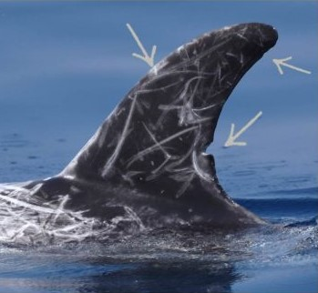
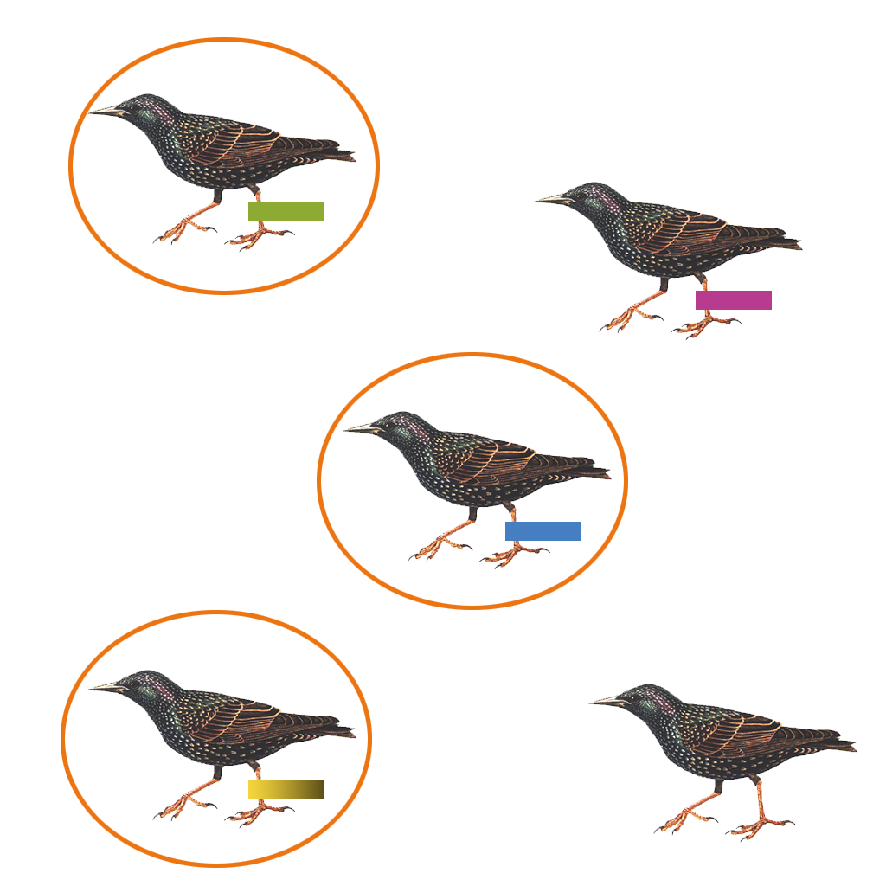

background-size: cover
background-image: url(https://upload.wikimedia.org/wikipedia/commons/1/16/Coenonympha_tullia_CMR%2C_Drugeon_-_img_47288.jpg)
class: center, top, inverse

```{r setup, include=FALSE}
options(htmltools.dir.version = FALSE)
```

# From marked animals to population dynamics
---
class: center, middle

# Population dynamics

### describe the variation of population size & demographic parameters in time
---
# Content

--

### Indices of abundance
--

### Detectability issues 
--

### Capture-Mark-recapture
  + closed populations
  + Lincoln-Petersen index 
  + heterogeneity in capture probabilities
--

### Demography
  + relaxing the closure assumption
  + Cormack-Jolly-Seber models
--

### Extensions
---
class: inverse, middle, center

# Estimating abundance

---
class:  middle, center

# abundance

### "The total number of individuals of a species or type present in a given area, in a given ecosystem or within a particular habitat." 
#### (Lawrence, 2005)

---
# Population size & detectability

--

.pull-left[


- True population size: $N=5$


]


  
--

---
# Population size & detectability
.pull-left[

- True population size: $N=5$


- Can't be measured because detection probability $p$ is (almost always) < 1

- $C$ is our actual count of individuals


- If we know our detection probability


#### $$N = \frac{C}{p} = \frac{3}{0.6} = 5$$


]


---
class: inverse, middle, center

# capture-mark-recapture (CMR)

---
# Tags to identify individuals

  
 
    
  
  
  
  

---

# Using natural / existing marks

  
 
    
  
---
# Using environmental markers

  
 
.pull-left[ 
### DNA sampling

### sound recordings

### etc.

]
  
---
class: inverse, middle, center

# closed population

---
background-image: url(https://animalfactguide.com/wp-content/uploads/2010/11/iStock_000004285123XSmall.jpg)
background-size: 400px
background-position: 90% 25%


# closure assumption between surveys*
 
.pull-left[ 
### constant membership:
###- no deaths
###- no births
###- no immigration
###- no emigration

### * survey length depends on life-history of your focal species
]

---

# CMR (closed populations)


---
# CMR (closed populations)


  

### 1 Capture individuals


### 2 Mark individuals

.pull-left[ 

- detection probability $p$ is usually < 1 (not all individuals are captured)

- All captured individuals are individually marked ( $M$ ) 

]
--

---
# Recapture individuals


  
--

.pull-left[ 

- detection probability $p$ is usually < 1 (not all individuals are captured)

- We repeat the capturing (our sample size is noted $S$ )

- Among these individuals, some will be already marked (recaptures: $R$ )

- Lincoln Petersen-method:

$$\hat{N}=\displaystyle{\frac{M \times S}{R}}$$
- in our example:

$$\hat{N}=\displaystyle{\frac{3 \times 3}{2}} = 4.5$$

]
  
---
class: center

# Lincoln-Petersen index

$$\hat{N}=\displaystyle{\frac{M \times S}{R}}$$
--

### we can rewrite this into individual capture histories
(where 1 = detected, 0 =  not detected:

```{r, echo= FALSE}
kableExtra::kable(
  data.frame(
  cature_history = c("10","01","11"),
  description = c("seen at first capture, not seen at second capture",
                  "seen at second capture, not seen at first capture",
                  "seen at first capture, seen at second capture"),
  prob = c( "p1(1-p2)",
            "(1-p1)p2",
            "p1p2")),
  format='html'
)
```
--

### and estimate the population size:

$$\hat{N}=\displaystyle{\frac{n_{10}+n_{01}+n_{11}}{1 - (1-p_1) \times (1-p_2)}}$$
--

---
# Our example
.pull-left[ 
$$\hat{N}=\displaystyle{\frac{n_{10}+n_{01}+n_{11}}{1 - (1-p_1) \times (1-p_2)}}$$
+ 1 bird captured only during first occasion

+ 1 bird captured only during second occasion

+ 2 birds captured during both occasions

+ capture probability $p$ is constant 3/5

$$\hat{N}=\displaystyle{\frac{1_{10}+1_{01}+2_{11}}{1 - (1-3/5) \times (1-3/5)}} =$$
$$\hat{N}=\displaystyle{\frac{4}{0.84}} = 4.76$$

]


---
# Lincoln-Petersen assumptions
--


+ closed population 
--


+ Tags are not lost (otherwise we overestimate $\hat{N}$ )
--


+ All individuals have the same probability to be captured
--


#### ... but what if capture probabilities differ?
--

### capture probabilities can vary: 

+ individual level (sex, age, infection status, etc.)

+ sampling level (time, sampling effort)

+ or both

---
class: inverse, middle, center

# capture-mark-recapture 
#### > 2 capture occasions

---
# Generalisation of Lincoln-Petersen

--

+ we can generalise the Lincoln-Petersen model and use it for more than 2 sampling occasions

--

+ same assumptions (closure, no tag-loss, equal capture probability)

--

+ capture histories for each individual:

```{r, echo= FALSE}
kableExtra::kable(
  data.frame(
  cature_hist = c("101101","001101","...","111111"),
  description = c("seen, not seen, seen, seen, not seen, seen",
                  "not seen, not seen, seen, seen, not seen,seen",
                  "",
                  "always seen"),
  prob = c( "p(1-p)pp(1-p)p",
            "(1-p)(1-p)pp(1-p)p",
            "",
            "pppppp")),
  format='html'
)
```
--

#### this specific model (constant $p$ across all sampling occassions and between all groups such as sex, age, etc.) is often used as a NULL model ( $M_0$ )

---
# time-dependent capture probability
--

```{r, echo= FALSE}
kableExtra::kable(
  data.frame(
  cature_hist = c("101101","001101","...","111111"),
  description = c("seen, not seen, seen, seen, not seen, seen",
                  "not seen, not seen, seen, seen, not seen,seen",
                  "",
                  "always seen"),
  prob = c( "p1(1-p2)p3p4(1-p5)p6",
            "(1-p1)(1-p2)p3p4(1-p5)p6",
            "",
            "p1p2p3p4p5p6")),
  format='html'
)
```
--

+ These are already 7 parameters to estimate  ( $\hat{N}$ + $p_{1}$ + $p_{2}$ + $p_{3}$ + $p_{4}$ + $p_{5}$ + $p_{6}$ )
--


+ solving our equation gets more challenging with more parameters and more field surveys
--

---
# heterogeneity in capture probability
--


+ detection probability can depend on behavior (e.g. trap-shy individuals avoid getting captured after captured once)
--


+ detection probability can depend on individual covariates (e.g. age, sex, infection status, etc.) 

+ mixture models that account for heterogeneity (Pledger 2000, Pledger 2003)
--

+ more complex models: Maximum-likelihood estimator and model selection based on AIC (Akaike information criterion)
--

---
class: inverse, middle, center

# Demography

---
background-image: url(https://www.researchgate.net/profile/Thibaut-Bouveroux/publication/259150241/figure/fig1/AS:654039960281088@1532946686263/Basic-structure-of-classical-form-of-the-Pollocks-robust-design-from-Cooch-and-White_W640.jpg)
background-size: 600px
background-position: 50% 90%


# Relaxing the closure assumption
--

+ By relaxing our closure assumption, we can assess demographic parameters  
--


+ E.g. estimating survival ( $\phi_{i}$ ), i.e. an animal was marked at sampling occasion $i$, survives until sampling occasion $i + 1$ & is still part of the population (only for primary sampling occasions)
--

+ our detection probability $p$ is measured *at* individual sampling occasions, while our survival probability $\phi$ is measured between primary sampling occasions
---
class: center

# Capture histories & probabilities


$$\Pr(1011) = \phi_1 (1-p_2) \phi_2 p_3 \phi_3 p_4$$

$$\Pr(1101) = \phi_1 p_2 \phi_2 (1 - p_3) \phi_3 p_4$$
--

### encounter histories can have multiple "paths"

$$\Pr(1000) = \phi_1 (1-p_2) \phi_2 (1-p_3) \phi_3 (1-p4)$$+
$$\phi_1 (1-p_2) \phi_2 (1-p_3) (1-\phi_3)$$+
$$\phi_1 (1-p_2)  (1-\phi_2)$$+
$$(1-\phi_1)$$  
--


---
class: inverse, middle, center

# Cormack-Jolly-Seber

---
# Cormack-Jolly-Seber assumptions

+ no tag-loss & individuals are recorded without error

+ capture is a random sample of the population

+ survival and recapture probabilities are homogeneous

---
# Cormack-Jolly-Seber (CJS)

+ survival $\phi$ varies between sampling intervals

+ detection $p$ varies between sampling occasions
--

+ The CJS likelihood is the probability of the data given the parameters:


$$L(data | parameters)$$
--

+ We estimate all parameters via maximum likelihood estimation:

$$L(parameters | data)$$

+ explanation of how maximum likelihood estimators (MLE) work: https://youtu.be/XepXtl9YKwc
--


+ CJS models allow to incorporate covariates

--

---
class: inverse, middle, center

# covariates in CJS models

---
# Covariates in CJS

+ Often, we wish to explain heterogeneity in survival based on sex, age-class, social rank, etc. (i.e discrete covariates)
--


+ e.g. estimate survival based on social rank for each individual (low = 0, high = 1):

$$logit(\phi_{i}) = \beta_{1} + \beta_{2} rank_{i}$$ 

+ Here, we use the logit link function to estimate parameters on the probability scale (0,1)

--

+ $logit(\phi_{i}) = \beta_{1}$ is the survival for low-ranked individuals &

+ $logit(\phi_{i}) = \beta_{1} + \beta_{2}$ is the survival for high-ranked individuals
--

---
# Covariates in CJS

+ continuous covariates can be included (e.g. weight, size, etc):

$$logit(\phi_{i}) = \beta_{1} + \beta_{2} x_{i}$$ 
--

+ temporal covariates can be included (e.g. weather events, predator abundance, etc.):

$$logit(\phi_{t}) = \beta_{1} + \beta_{2} x_{t}$$ 
--

+ covariates can also vary with individual & time (e.g. age, body size, infection status)

+ in case of non-detection: model covariates (e.g. age) or use discrete values (e.g. discretized body size)

---
# Survival vs. apparent survival

+ we estimate **apparent survival**, because we can't distinguish between mortality & permanent emigration
--


+ apparent survival < true survival, because site-fidelity is almost never 1 (i.e. some individuals emigrate permanently or disperse)
--

+ to estimate **true survival**: 
  + add data about death events (e.g. ring recovery)
  + extend models (e.g. Multistate-Capture-recapture models that incorporate space)

---
# Extensions


  
+ There are many extensions to CMR (not covered here)
--

+ Powerful & flexible tools that account for transition between:
  + sites, i.e. spatial transition (multisite CMR)
  + states, e.g. internal states such as infection status (multistate models)
--


+ we can even incorporate uncertainty in the observation processes (multievent models)
---
# Example - swallows & disease dynamics


  
.pull-left[

+ estimating demography parameters & disease dynamics in swallow colonies

+ assess transition between infection states (probability to infect or clear infection)

+ incorporate uncertainty in disease status (not every individual can be tested)

]
---
# Example - swallows & disease dynamics


  
---
class: inverse, middle, center

# Thank you! Questions?

---
class: inverse, middle, center

# Let's practice! We will now fit CJS-models for starlings in Berlin


